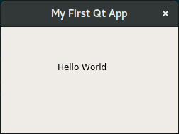

# docker-pyqt5
[](https://microbadger.com/images/jozo/pyqt5 "Get your own image badge on microbadger.com")

Dockerfile for development of GUI applications with Python 3 + PyQt5


Tested on Ubuntu 20.04

**Links**: [GitHub repo](https://github.com/jozo/docker-pyqt5), [Docker Hub](https://hub.docker.com/r/jozo/pyqt5)

## How to use it on Linux
You can test if everything works with the small testing app included in this 
docker image. You can try it with:

```
docker run --rm -it \
    -v /tmp/.X11-unix:/tmp/.X11-unix \
    -e DISPLAY=$DISPLAY \
    -u qtuser \
    jozo/pyqt5 python3 /tmp/hello.py
```

You should see a window similar to this:



## How to use it on MacOS
1. Install [XQuartz](https://www.xquartz.org).
2. In XQuartz: Check the option: XQuartz -> Preferences -> Security -> "Allow connections from network clients"
3. Run in terminal:
```
IP=$(ifconfig en0 | grep inet | awk '$1=="inet" {print $2}')
xhost +
```

You can test if everything works with the small testing app included in this
docker image. You can try it with:

```
docker run --rm -it \
    -v /tmp/.X11-unix:/tmp/.X11-unix \
    -e DISPLAY=$IP:0 \
    -u qtuser \
    jozo/pyqt5 python3 /tmp/hello.py
```


## Other Dockerfiles
**Python 3 + PyQt5:**
https://github.com/jozo/docker-pyqt5
 
**Python 3 + PyQt5 + QML:**
https://github.com/jozo/docker-pyqt5-qml

**Python 3 + PyQt5 + QML + QtMultimedia:**
https://github.com/jozo/docker-pyqt5-qml-qtmultimedia

**Build locally**
```
docker build -t fadawar/pyqt5 .
```
